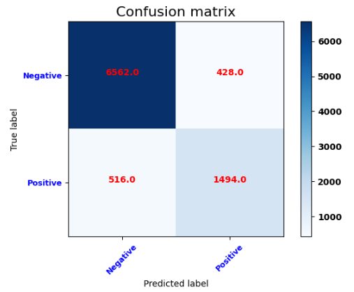
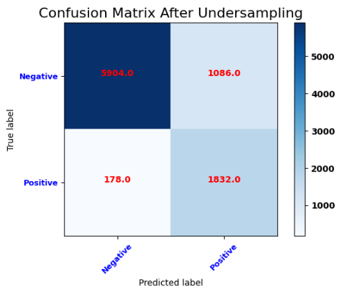

# Imbalanced Dataset and Resampling Methods

* Oversampling
* SMOTE
* Undersampling
## Base Model Confusuion Matrix

## After Undersampling

* We used various sampling methods to more accurately estimate the minority class in imbalanced datasets.
* We wanted to increase the Recall metric as a priority.
* After undersampling, we reached the highest recall value of 0.91.
